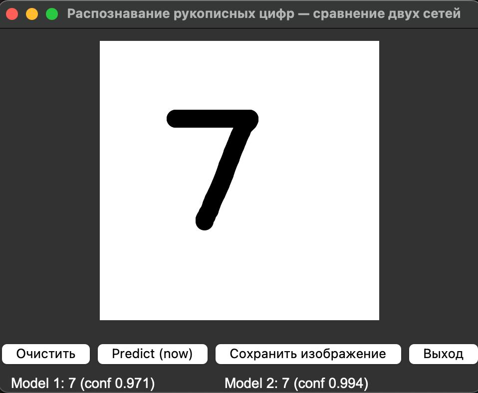

# Распознавание рукописных цифр — сравнение двух нейросетей

Проект по распознаванию рукописных цифр (MNIST) с помощью свёрточных нейросетей.
Обучаются **две модели**, сравнивается их качество, и есть GUI, где можно рисовать
цифру мышью и смотреть предсказания обеих сетей в реальном времени.

## Описание

Датасет MNIST (70 000 изображений 28×28) перемешивается и делится пополам:

- **Model 1 (`simple_cnn`)** — простая CNN, обучается на половине A **без аугментации**.
- **Model 2 (`deep_cnn`)** — более глубокая CNN (BatchNormalization + Dropout),
  обучается на половине B **с аугментацией** (повороты, сдвиги, зум, сдвиг).

Обе модели сохраняются в папку `models/`, туда же складываются отложенные тестовые
выборки для последующей оценки.

## Структура проекта

```
train_models.py      # обучение обеих моделей и сохранение в models/
evaluate_models.py   # оценка моделей (accuracy, precision, recall, confusion matrix)
gui.py               # GUI: рисуем цифру мышью, получаем предсказания обеих сетей
models/              # сохранённые модели (.h5) и тестовые выборки (.npy)
requirements.txt     # зависимости
```

## Установка

```bash
python -m venv venv
source venv/bin/activate      # Windows: venv\Scripts\activate
pip install -r requirements.txt
```

## Использование

### 1. Обучение моделей

```bash
python train_models.py
```

Скрипт скачает MNIST, обучит обе модели (12 эпох, batch size 128) и сохранит:

- `models/model_mnist.h5` — Model 1;
- `models/model_augmented.h5` — Model 2;
- `models/meta_test_*.npy` — отложенные тестовые выборки для оценки.

### 2. Оценка качества

```bash
python evaluate_models.py
```

Выводит accuracy, precision (macro) и recall (macro) для каждой модели и строит
матрицы ошибок (confusion matrix) через matplotlib/seaborn.

> Требует, чтобы модели и `meta_test_*.npy` уже были созданы `train_models.py`.

### 3. Интерактивное распознавание (GUI)

```bash
python gui.py
```

Откроется окно, где можно:

- рисовать цифру мышью на холсте;
- видеть предсказания обеих моделей с уверенностью (confidence);
- очищать холст, сохранять рисунок в `drawn_digit.png`.

Предсказание обновляется автоматически при отпускании кнопки мыши.

## Как это выглядит

<!-- Вставь сюда скриншот работы GUI. Положи картинку рядом с README (например в папку docs/) и укажи путь -->



## Зависимости

- tensorflow >= 2.14
- numpy
- scikit-learn
- matplotlib / seaborn
- pillow
- tk (tkinter)